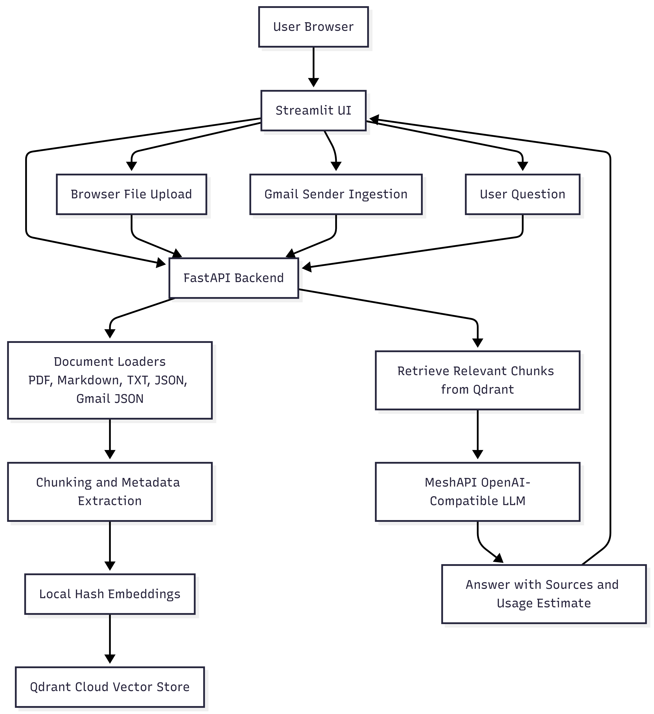
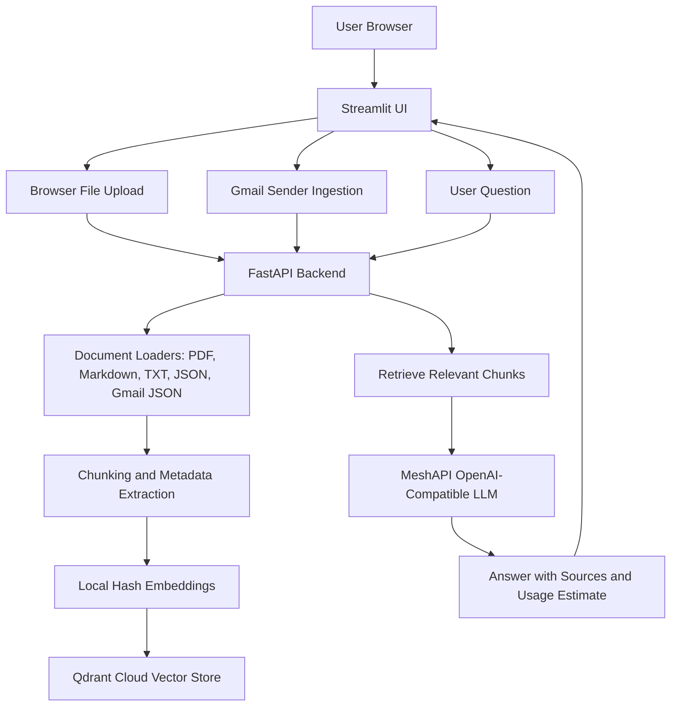

# School RAG App

A browser-based Retrieval Augmented Generation app for ingesting school documents and Gmail messages from teachers, indexing them in Qdrant and Parents can ask questions through a Streamlit chat UI.

## Problem Statement

Schools/Teachers often have important information spread across PDFs, notes, exported documents, and email threads. Finding the right assignments, posted stuy materials, announcement or teacher instructionx can take too long and often requires searching many different places.

This project solves that problem by ingesting school files and Gmail messages into a vector database, then ask natural-language questions and receive grounded answers with source snippets.

## Public URL
http://school-rag-alb-801552592.us-east-1.elb.amazonaws.com/

## Architecture Diagram





## Tech Stack

- Python 3.10+
- Streamlit for the browser UI
- FastAPI for backend ingestion and chat endpoints
- LlamaIndex for document loading, chunking, indexing, and retrieval
- Qdrant Cloud for vector search
- MeshAPI using an OpenAI-compatible chat API
- Local hash embeddings by default
- Gmail API for Gmail sender ingestion
- Docker for containerized deployment
- AWS ECR, ECS, Fargate, ALB, CloudWatch, and Secrets Manager for hosting

## Setup and Installation

Clone the repository and enter the project folder:

```powershell
git clone <your-repo-url>
cd school-RAG
```

Create and activate a virtual environment:

```powershell
python -m venv .venv
.\.venv\Scripts\Activate.ps1
```

Install dependencies:

```powershell
pip install -r requirements.txt
```

Create a local environment file:

```powershell
copy .env.example .env
```

Update `.env` with your own values:

```env
MESH_API_KEY=your-meshapi-key
MESH_API_BASE_URL=https://api.meshapi.ai/v1

QDRANT_URL=https://your-qdrant-cloud-url
QDRANT_API_KEY=your-qdrant-api-key
QDRANT_COLLECTION=school_rag_demo

OPENAI_LLM_MODEL=gpt-4.1-nano
EMBEDDING_PROVIDER=local_hash
LOCAL_HASH_EMBEDDING_DIM=384

GMAIL_CREDENTIALS_FILE=data/secrets/gmail_credentials.json
GMAIL_TOKEN_FILE=data/secrets/gmail_token.json
GMAIL_JSON_OUTPUT_FOLDER=data/gmail_json
```

Create the private Gmail secrets folder:

```powershell
New-Item -ItemType Directory -Force data\secrets
```

Place Gmail OAuth files here if you want Gmail ingestion:

```text
data/secrets/gmail_credentials.json
data/secrets/gmail_token.json
```

These files are ignored by Git and should not be committed.

## How to Run Locally

Start the FastAPI backend:

```powershell
uvicorn src.rag_app.api:app --host 0.0.0.0 --port 8000 --reload
```

In a second terminal, start Streamlit:

```powershell
$env:API_BASE_URL="http://localhost:8000"
streamlit run streamlit_app.py
```

Open the app:

```text
http://localhost:8501
```

You can then:

- Upload `.pdf`, `.txt`, `.md`, `.markdown`, or `.json` files from the browser.
- Click **Upload and ingest**.
- Ask questions about the ingested documents.
- Optionally ingest Gmail messages by sender if Gmail OAuth files are configured.

## Useful API Endpoints

Health check:

```http
GET /health
```

Upload and ingest browser files:

```http
POST /upload/ingest
Content-Type: multipart/form-data
```

Ingest a server-side folder:

```http
POST /ingest
Content-Type: application/json

{
  "folder_path": "data/documents"
}
```

Chat:

```http
POST /chat
Content-Type: application/json

{
  "question": "What homework did the teacher assign?",
  "top_k": 5
}
```

## Deployment Notes

For AWS hosting, use Docker, ECR, ECS Fargate, an Application Load Balancer, CloudWatch logs, and AWS Secrets Manager. Do not bake `.env` or `data/secrets/*` into the image. Runtime secrets should be injected by ECS and written into the expected file paths by the container entrypoint.

See:

```text
docs/AWS_ECS_ECR_DEPLOYMENT.md
```
## Missing features/limitations
* Auto ingestion of files from drives to the \data folder is not in place
* Auto ingestion of emails in GMAIL folder to \data folder as json files is not in place. User had to initiate it from the front end
* Scraping is not in place- Crawler that visits allowed school pages, extracts announcements, calendars, lunch menus, policy pages, homework pages, athletics pages, etc., then saves clean JSON for ingestion.
* Asking questions by source - for example : answer only using emails received from school
* Authentication 
